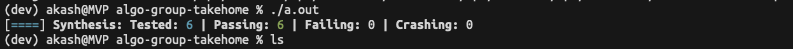

# AlgoGroup Take-Home Assessment Question 3 Green Screen
Akash Piya

## Reasoning/Methodology 
If x (column), y (row) are coordinates for a pixel in the source image, then x + offsetX and y + offsetY are its coordinates in the destination image. So my solution is as follows:
- Iterate through every pixel in the source image.
- Translate the pixel's coordinate according to the rule above.
- Convert the 2D coordinates of the source and destination pixels into 1D array indices.
- If the source pixel has a special value skip the copying of that pixel. Otherwise copy it through 

This solution iterates through every pixel in the source image so the runtime is O(M * N) where M and N are the width and height of the source image.

## Run
Run tests with the following command in this directory: `make tests` then `./tests`.

## Proof of Passing Tests

